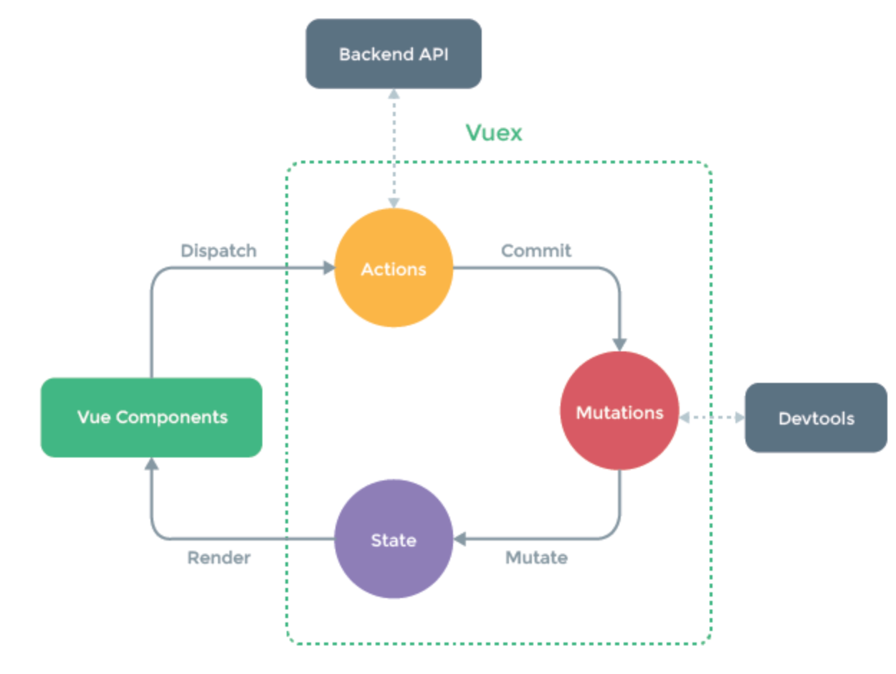

# vuejs-playground

[강의 : inflearn vuejs 완벽가이드](https://www.inflearn.com/course/vue-js)  
강의 듣고 정리하기  
강의 듣고 따라하기  

## 개발환경

- chrome
- npm
- vscode
  - 기본과 동일
  - tslint
- vue
- github
- [스타일가이드](https://vuejs.org/v2/style-guide/)

## application 제작

### project setting

- [hacker news](https://news.ycombinator.com/)
  - show, ask, jobs 페이지 사용
- api: [hacker news api](https://github.com/tastejs/hacker-news-pwas/blob/master/docs/api.md)
  - show, ask, jobs api 사용
- router design
  - news, ask, jobs 각각 페이지
  - 질문페이지
  - 사용자 상세정보
- vue cli
  - 명령어
    - 2.x -> `vue init webpack-simple vue-news`
    - 3.x -> `vue create vue-cli3`
  - 웹팩 설정 파일 (webpack.config.js 파일의 여부)
    - 2.x -> 노출
    - 3.x -> 미노출
  - 프로젝트 구성
    - 2.x: 깃헙의 템플릿 다운로드
    - 3.x: 플러그인 기반 기능 추가
  - es6
    - 2.x: 필요없음
    - 3.x: 필요
- `vue create vue-news` 프로젝트 생성
  - preset : 프로젝트 시작을 위한 기본 플러그인 구성
  - babel : es6 변환, eslint: 문법체크
- `npm run serve` 로컬 웹서버 실행
- eslint
  - javascript syntax helper
  - ignore error
    - `/* eslint-disable */` 컴포넌트 스크립트마다 입력
    - `vue-news/vue.config.js` 생성 후 아래 코드 입력
    - [lintOnSave](https://cli.vuejs.org/config/#pages)

### router 추가

- `npm i vue-router --save`
- package.json 내에 dependencies에 추가
  - 배포할때도 필요한 라이브러리가 위치해야함.
- main.js
  - main.js는 어플리케이션의 설정, 플러그인, 라이브러리 등을 표현할 수 있는 청사진 구조여야함
  - 라우터는 분리하는 것이 좋음
  - `src/router/index.js`
- src/views 폴더
  - 라우터에 들어가는 컴포넌트(화면) 이 들어갈 dir
  - .vue 파일들
- `<router-link></router-link>` : a tag 치환
- `import { router } from './router/index.js';` 와 `import router from './router/index.js';` 의 차이

#### component

- `<ToolBar></ToolBar>` vs `<tool-bar></tool-bar>`
  - 카멜케이스 : 대문자로 시작하기 때문에 명시적으로 컴포넌트로 알 수 있음, vue에서 강력하게 권장함.
  - 케밥케이스 : 타이핑 시 자동완성이 되서 생산성에 좋음, cmd + click으로 파일도 찾아가기 원활함.
- test
- `<style scoped>` : 해당 컴포넌트에만 스타일이 적용되도록 하는 옵션
  - `display: flex;` : https://heropy.blog/2018/11/24/css-flexible-box/ | https://webdir.tistory.com/349
  
### api

#### dir 구조

- views : routing 정보만 담은 화면 컴포넌트, axios나 로직이 들어가면 안됨. 페이지 역할을 하는 컴포넌트는 데이터를 fetch 하는 로직이 들어가면 좋지 않음
  - views 컴포넌트는 유연하게 대응할 수 있어야함
  
#### lifecycle

- component가 생성되자마자 실행되는 로직

```javascript
created: function() {
}
created() {
}
```

- beforMount: created와 같이 data를 받아올 때 주로 사용
- mounted
  - 마운트 후에 data 속성에 할당하게 되면, 뷰의 reactivity에 의하여 화면이 다시 그려지게 된다.
  - https://vuejs.org/v2/guide/reactivity.html#ad

### vuex


- 상태관리도구
  - 여러 컴포넌트에서 공유되는 속성
  - 컴포넌트 레벨이 복잡해 졌을 때 컴포넌트간 데이터 공유가 용이해짐
- 컴포넌트마다 api를 불러오지 않도록 변경
  - api -> newsView >>> api -> vuex -> newsView
  - vuex의 state에 값을 담아서 화면에 표시
- 설치: `npm i vuex`
- store 패키지 하위에 생성

#### action

- 비동기 호출
- context 인자로 mutation을 호출

#### mutation

- 액션에서 받아온 api 결과 데이터를 state 에 담아줌.

#### state

- 컴포넌트에서 공유가능
  
## es6

### template string

```javascript
const config = {
  baseUrl: 'https://api.hnpwa.com/v0'
};

return axios.get(config.baseUrl + '/news/1.json');
return axios.get(`${config.baseUrl}/news/1.json`);
```

### =>

```javascript
var vm = this;
fetchJobsList()
  .then(function(response) {
    vm.jobs = response.data;
  })
  .catch(function(error) {});
}
//위 아래 동일
fetchJobsList()
  .then(response => this.jobs = response.data)
  .catch(error => console.log(error));
```

### this

- 가장 최상단 객체 window
- 전역범위. (다른 언어에서의 this는 지역범위에서 확장되는것과 반대)

```javascript
console.log(this); //window
```

```javascript
function sum(a, b) {
  console.log(this); //window
  return a + b;
}
```

```javascript
'use strict'
function sum(a, b) {
  console.log(this); //undefined
  return a + b;
}
```

```javascript
function Vue(el) {
  console.log(this); //Vue {}, 함수 객체 자체
  this.el = el;
}
```

```javascript
console.log(this); //VueComponent
fetchAskList()
.then(function(response) {
  console.log(this); //undefined
})
.catch(function(error) {});
```

- 비동기 호출 : 기존 this를 벗어난 this가 생성됨.
- => 함수 : this가 비동기 함수 내 this가 아닌 원래의 객체 this를 가리킴.
  - => 함수 추천!

### 비동기처리

#### callback

- 함수 종료시에 실행되는 함수
- 함수를 파라미터로 전달하고 그 함수가 콜백함수

```javascript
var result = [];
//jquery
$.ajax({
  url: 'https://www.naver.com/api/',
  succcess: function(data) {
    result = data;
  }
});
console.log(result); //[]
```

#### promise

- then, cathc 체이닝을 위해서는 상위 함수가 promise 객체를 리턴해줘야함
- promise는 resolve, reject를 파라미터로 가짐

```javascript
function callAjax() {
  return new Promise(function(resolve, reject) {
    $.ajax({
      url: 'https://www.naver.com/api/',
      succcess: function(data) {
        resolve(data); //resolve -> then() 으로 연결
      }
    });
  });
}

function fetchData() {
  callAjax()
    .then(function(data) {
      console.log(data);
    })
}
```

## tip

- chrome network tap 에서 `Online` > `slow 3g` 로 하면 데이터를 느리게 받아올 수 있음
